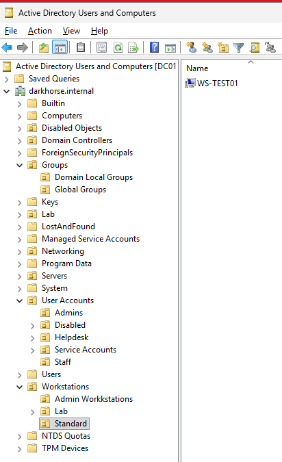
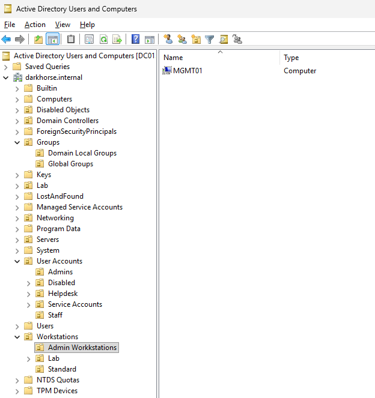
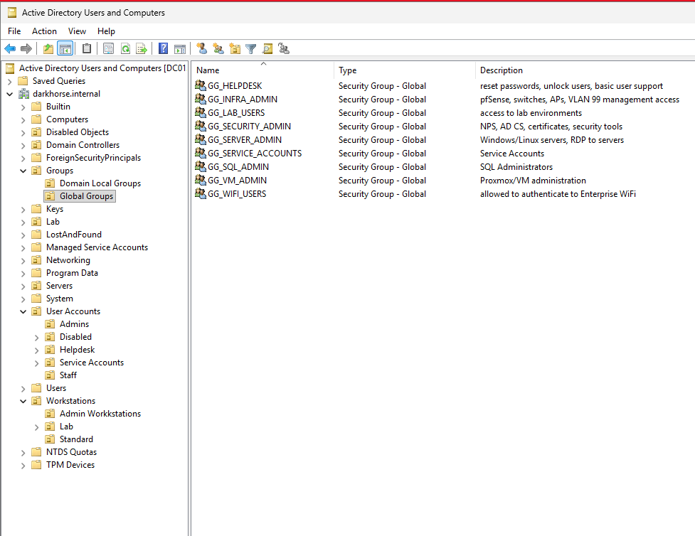
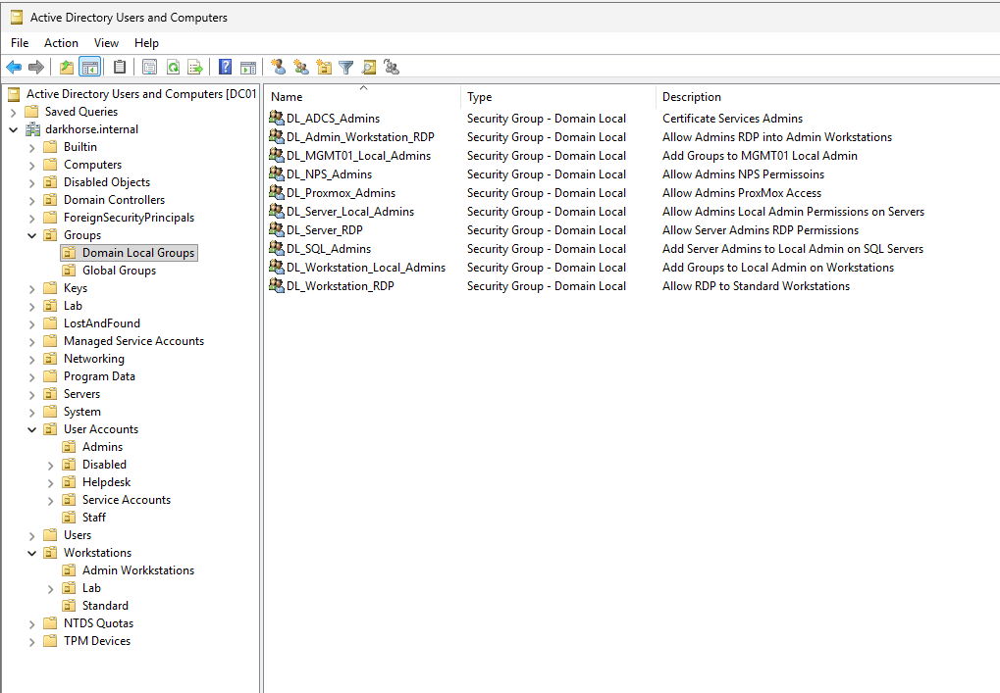

# Active Directory RBAC & Delegation Lab

## Overview

This project demonstrates the implementation of enterprise Role-Based Access Control (RBAC) within Active Directory.


## Business Problem

In many organizations, permissions are assigned directly to users, creating administrative overhead, inconsistent access controls, and increased risk of permission creep.

This project demonstrates how Role-Based Access Control (RBAC) can be implemented in Active Directory using Microsoft's AGDLP methodology to provide scalable, auditable, and least-privilege access management.

The lab specifically focuses on controlling Remote Desktop access to standard and privileged workstations while maintaining clear separation between identity, policy, and permissions.

<br>
The objective was to create a scalable and secure permission model that separates identity, policy, and authorization while following least privilege principles.

<br>
<br>


<br>
<br>

<br>

<p align="center">

</p>

<br>

## Project Outcomes

Successfully implemented:

- RBAC using AGDLP
- Administrative workstation isolation
- Role-based RDP authorization
- Group Policy controlled access
- Least privilege enforcement

Validated through functional testing and group membership removal.

<br>

## Lab Environment

| Component | Technology |
|------------|------------|
| Hypervisor | Proxmox VE |
| Domain Controller | Windows Server 2025 |
| Domain | darkhorse.internal |
| Management Workstation | MGMT01 |
| Standard Workstation | WS-TEST01 |
| Directory Service | Active Directory Domain Services (AD DS) |
| Policy Management | Group Policy |
| Access Model | AGDLP |
| Authorization Method | Security Groups |

<br>
<br>

## Validation Results

<br>

| Test | Expected Result | Outcome|
|------|-----------------|--------|
| Helpdesk → WS-TEST01 | RDP Allowed | PASS |
| Helpdesk → MGMT01 | RDP Denied | PASS |
| Infra Admin → WS-TEST01 | RDP Allowed | PASS |
| Infra Admin → MGMT01 | RDP Allowed | PASS |
| Remove Group Membership | Access Revoked | PASS |

<br>


## Organizational Unit Structure

The environment was organized using separate Organizational Units to distinguish standard workstations from privileged administrative workstations.


```text
Workstations
├── Standard
│   └── WS-TEST01
│
└── Admin Workstations
    └── MGMT01


Global Security Groups:

GG_HELPDESK
GG_INFRA_ADMIN


Domain Local Groups:

DL_WORKSTATION_RDP
DL_ADMIN_WORKSTATION_RDP


AGDLP Flow

User
↓
Global Group
↓
Domain Local Group
↓
Permission
↓
Resource
```
<table>
    <tr>
        <td align="center">
            
            <b>Standard Workstations OU</b>
        </td>
        <td align="center">
            
            <b>Admin Workstations OU</b>
        <td>
    <tr>
<table>

**Purpose**

- Standard Workstations OU contains user-facing endpoints.
- Admin Workstations OU contains privileged administrative systems.
- Separate OUs allow distinct Group Policies and authorization controls to be applied based on workstation role.
- This design supports administrative workstation isolation and least-privilege access principles.

<br>


## Security Group Design

The environment uses separate Global and Domain Local security groups to maintain a scalable AGDLP permission model.

---

### Global Groups (Identity)

Global Groups represent job roles and administrative responsibilities within the organization.

| Group | Purpose |
|---------|---------|
| GG_HELPDESK | Password resets, account unlocks, user support |
| GG_INFRA_ADMIN | Infrastructure administration |
| GG_SECURITY_ADMIN | AD CS, NPS, PKI administration |
| GG_SERVER_ADMIN | Server administration |
| GG_VM_ADMIN | Proxmox administration |

<br>

<p align="center">

</p>

<p align="center">
<em>Global Security Groups representing organizational roles and responsibilities.</em>
</p>

---

### Domain Local Groups (Permissions)

Domain Local Groups own permissions and resource access assignments.

| Group | Permission |
|---------|---------|
| DL_Workstation_RDP | RDP access to standard workstations |
| DL_Admin_Workstation_RDP | RDP access to administrative workstations |
| DL_Server_RDP | RDP access to servers |
| DL_Server_Local_Admins | Local administrator rights on servers |

<br>

<p align="center">

</p>

<p align="center">
<em>Domain Local Groups containing resource permissions and authorization assignments.</em>
</p>

---

### AGDLP Relationship

```text
User
 ↓
Global Group (Role)
 ↓
Domain Local Group (Permission)
 ↓
Resource
```

This design separates identity from authorization and simplifies permission management at scale. Rather than assigning permissions directly to users, access is granted through Domain Local Groups while Global Groups represent business roles. This approach improves scalability, auditing, and long-term maintainability.

<br>

In this lab, GG_HELPDESK is nested into DL_Workstation_RDP, while GG_INFRA_ADMIN is nested into DL_Admin_Workstation_RDP, demonstrating how role-based access is delegated without assigning permissions directly to users.

## Technologies Used
- Windows Server 2025
- Active Directory Domain Services
- Group Policy
- Organizational Units
- Security Groups
- Remote Desktop Services
- Windows Firewall
- AGDLP

<br>

## Project Documentation

- [RBAC Fundamentals](docs/01-rbac-fundamentals.md)
- [OU Design](docs/02-ou-design.md)
- [RDP Authorization Implementation](docs/03-rdp-rbac-implementation.md)
- [Validation Testing](docs/04-validation.md)
- [Troubleshooting](docs/05-troubleshooting.md)
- [Lessons Learned](docs/06-lessons-learned.md)

<br>

## Key Concepts
- RBAC
- AGDLP
- Least Privilege
- Identity vs Permissions
- OU Design
- Delegated Administration

<br>

## Skills Demonstrated
- Active Directory Administration
- Group Policy Management
- RBAC Design
- Access Control
- Windows Administration
- Troubleshooting

<br>

## Key Lessons Learned
- OUs organize policy, not permissions.
- Security Groups determine authorization.
- AGDLP creates scalable permission chains.
- Group Policy configuration and authorization should be separated.
- OU inheritance directly impacts GPO application.
- "Update" and "Replace" behave differently within Group Policy Preferences.
- Least privilege is easier to enforce when permissions are assigned through Domain Local groups.

<br>

## Resume Bullet

Designed and implemented enterprise Active Directory Role-Based Access Control (RBAC) using AGDLP, Organizational Units, Group Policy, delegated administration, and least-privilege principles to control Remote Desktop authorization across standard and privileged workstation tiers.

<br>