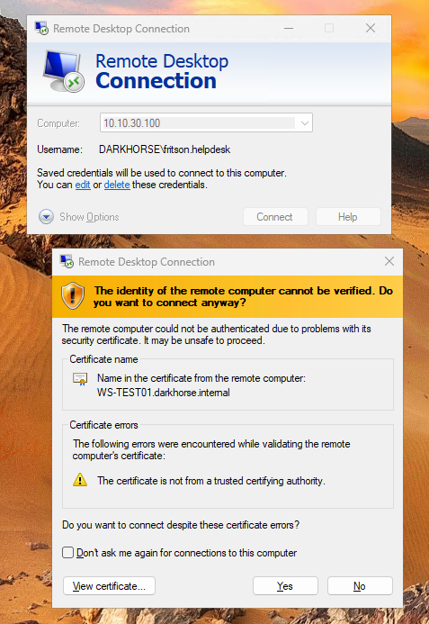
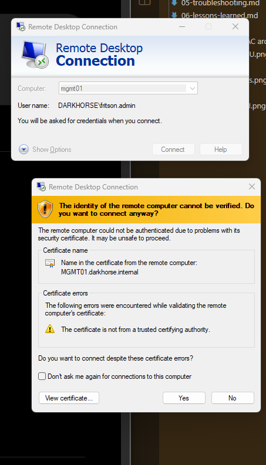
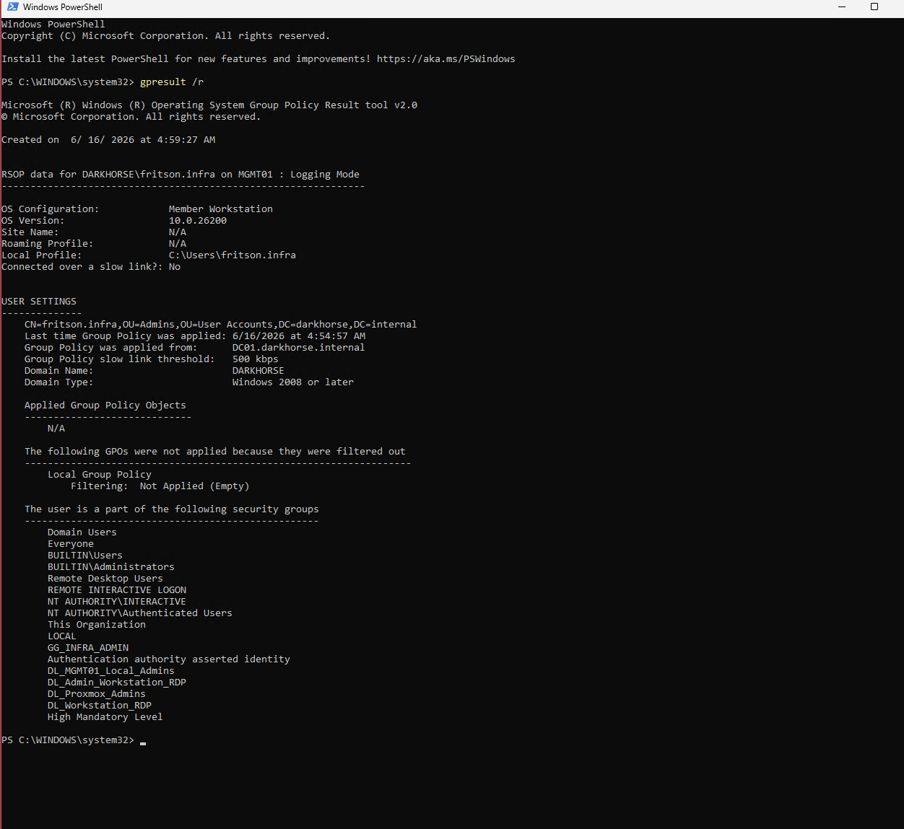
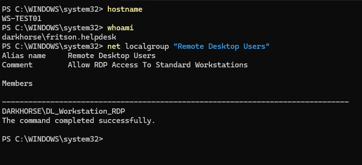
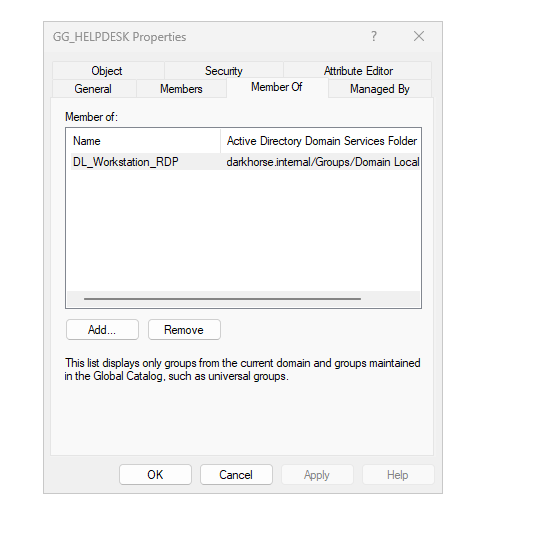
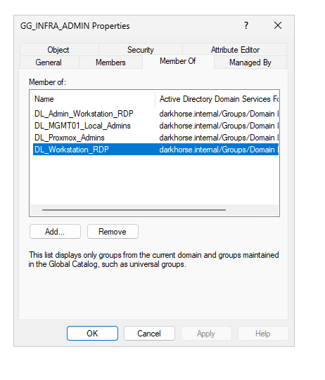

# Validation Testing

## Validation Objectives

The following tests were performed to verify:

- AGDLP group nesting
- GPO application
- RDP authorization
- Least privilege enforcement

---

## Test 1 - Helpdesk Access to Standard Workstation

### Expected

Helpdesk users can RDP to WS-TEST01.

### Evidence

### Result

PASS

### RDP Certificate Trust Warning

While validating administrative workstation access, the RDP client displayed a certificate trust warning.

The connection was authorized through RBAC and Group Policy, however the workstation did not trust the certificate presented by MGMT01.

This occurred because the environment had not yet implemented Active Directory Certificate Services (AD CS).

Future implementation of AD CS and certificate auto-enrollment will allow administrative workstations to present certificates issued by a trusted enterprise Certification Authority, eliminating this warning.

---

## Test 2 - Helpdesk Access to Administrative Workstation

### Expected

Helpdesk users cannot RDP to MGMT01.

### Evidence

<table>
    <tr>
        <td align="center">
            
        </td>
        <td align="center">
            
        </td>
    <tr>
<table>

### Result

PASS

---

## Test 3 - Infrastructure Admin Access to Administrative Workstation

### Expected

Infrastructure Administrators can RDP to MGMT01.

### Evidence

### Result

PASS

### RDP Certificate Trust Warning

While validating administrative workstation access, the RDP client displayed a certificate trust warning.

The connection was authorized through RBAC and Group Policy, however the workstation did not trust the certificate presented by MGMT01.

This occurred because the environment had not yet implemented Active Directory Certificate Services (AD CS).

Future implementation of AD CS and certificate auto-enrollment will allow administrative workstations to present certificates issued by a trusted enterprise Certification Authority, eliminating this warning.

---

## Test 4 - Group Policy Application

### Evidence

gpresult /r

### Result

PASS

---

## Test 5 - Remote Desktop Users Membership

### Evidence

net localgroup

### Result

PASS

---

## Test 6 - AGDLP Verification

### Evidence

<table>
    <tr>
        <td align="center">
            
            <b>GG_HELPDESK member of DL_Workstation_RDP</b>
        </td>
        <td align="center">
            
            <b>GG_INFRA_ADMIN member of DL_Admin_Workstation_RDP</b>
        </td>
    <tr>
<table>

### Result

PASS

